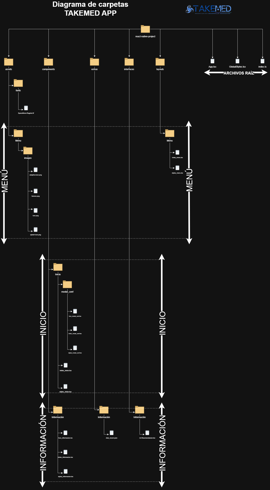

# TAKEMED APP

TakeMed es una aplicación móvil simple desarrollada en React Native que ofrece consejos de salud y se conecta con un dispositivo BLE. La aplicación utiliza Expo CLI para facilitar el desarrollo y despliegue. El diseño es intuitivo, con una estética moderna y animaciones para mejorar la experiencia del usuario.

## Estructura del Proyecto


## INSTRUCCIONES DE EJECUCIÓN

## Requisitos Previos
* Node.js y npm instalados. [Descargar Node.js](https://nodejs.org)
* Expo CLI instalado (opcional, en caso de no usar `npx`). Instálalo ejecutando:
  ```bash
  npm install -g expo-cli

Clonar el repositorio
```git clone https://github.com/victsilva37/takemed-app```

Dirigirse al directorio **react-native-project** donde encuentra el código base del proyecto
```cd react-native-project```

Instalar dependencias
* ```npm install```

Ejecutar Expo y escanear el código QR desde la aplicación [Expo Go](https://expo.dev/client)
* ```npx expo start```

En caso de que el comando anterior genere error al escanear el código QR, puede ejecutar lo siguiente. Siempre y cuando esté conectado a la misma red Wifi para que detecte la aplicación de Expo Go. 
* ```npx expo start --tunnel```

Suele no conectarse la primera vez, por lo que debe ejecutarlo más una vez hasta que aparezca esta respuesta:

* Starting Metro Bundler
  Tunnel connected.
  Tunnel ready.


